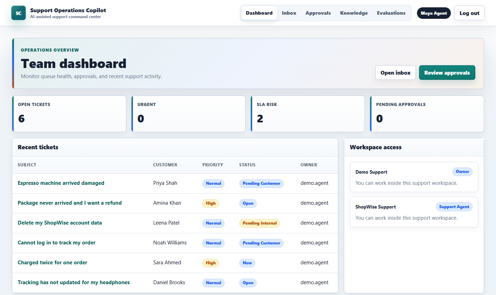
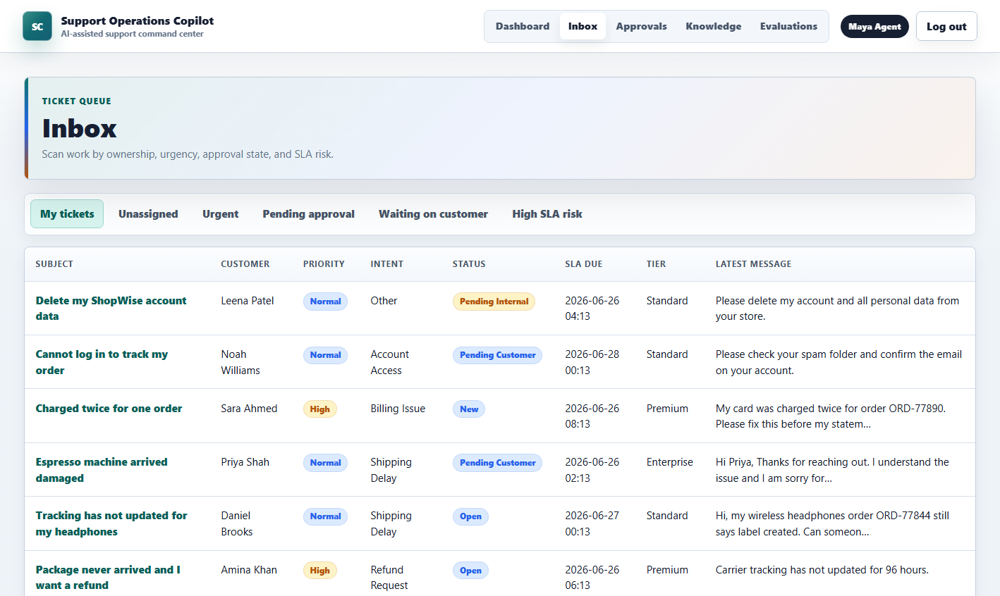
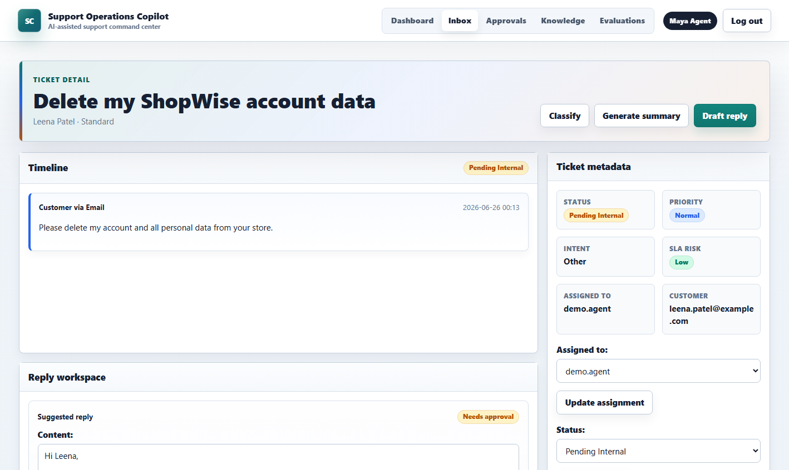
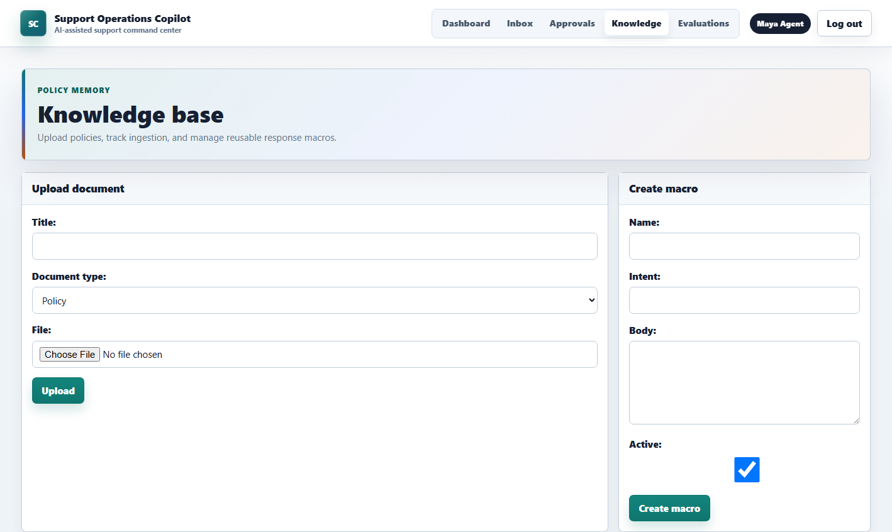
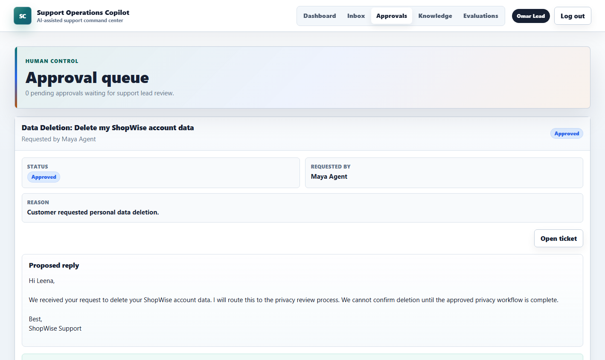
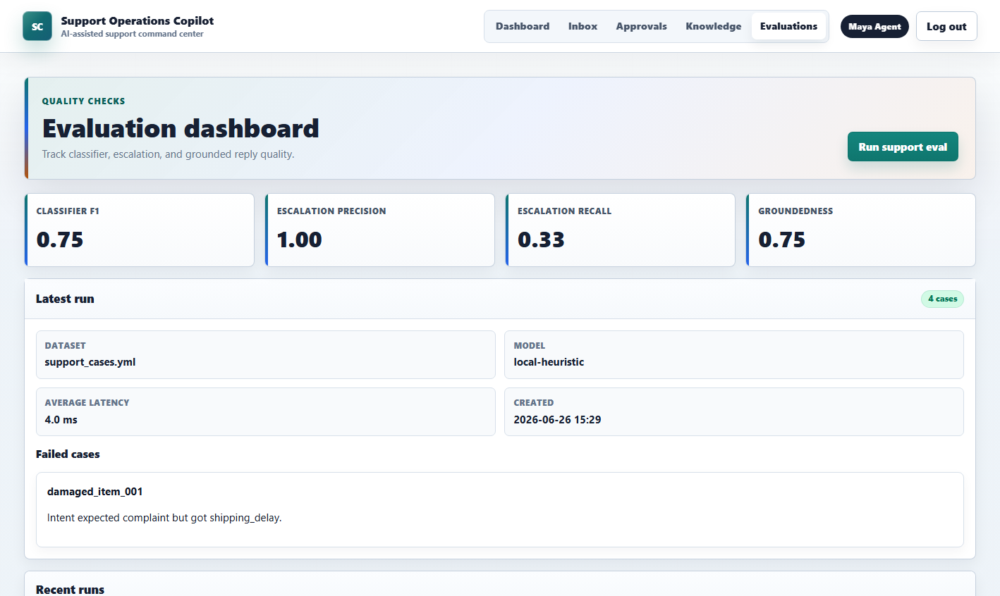

# Support Operations Copilot

AI-assisted support operations workspace for ecommerce support teams.

Support Operations Copilot helps agents triage tickets, draft grounded replies,
summarize customer conversations, route sensitive actions through support leads,
and evaluate AI quality before it reaches customers.



## Why This Exists

Support teams want faster replies, but they cannot let AI independently promise
refunds, cancel accounts, delete data, or send customer-impacting messages. This
project is built around a safer operating model: AI assists, humans review, and
sensitive actions require approval.

## Highlights

- Ticket inbox with ownership, priority, SLA risk, status, and customer tier filters.
- Knowledge base for policies, troubleshooting docs, and reusable support macros.
- Retrieval-grounded reply drafting with source snapshots and editable drafts.
- PII redaction before external model calls.
- Ticket classification for intent, priority, sentiment, SLA risk, and escalation.
- Internal ticket summaries, recommended next actions, and macro recommendations.
- Approval queue for refunds, cancellations, credits, account closure, data export,
  and data deletion.
- Agent feedback and evaluation dashboard for classifier, escalation, and groundedness.
- Ecommerce demo workspace with realistic tickets, policies, customers, and approvals.
- Docker Compose local stack with Django, PostgreSQL, Redis, and Celery.
- CI with Django checks, migration checks, Ruff, pytest, Playwright smoke tests,
  Docker image build, and Trivy scan.

## Screenshots

| Dashboard | Inbox |
| --- | --- |
|  |  |

| Ticket Detail | Knowledge Base |
| --- | --- |
|  |  |

| Approvals | Evaluations |
| --- | --- |
|  |  |

## Tech Stack

- Django 5.2
- Django REST Framework
- Django Channels
- Celery
- PostgreSQL with pgvector-ready image
- Redis
- Docker Compose
- OpenAI API integration with deterministic local fallbacks
- Pytest, Ruff, Playwright, GitHub Actions, Trivy

## Architecture

```text
Browser
  |
  v
Django views / DRF / Channels
  |
  +--> PostgreSQL
  +--> Redis
  +--> Celery workers
  +--> AI services and local fallbacks
```

Core background tasks:

- `workers.classify_ticket.classify_ticket`
- `workers.draft_reply.draft_reply`
- `workers.ingest_knowledge.ingest_knowledge_document`
- `workers.summarize_thread.summarize_thread`
- `workers.run_eval.run_evaluation`

## Local Setup

Create a local environment file:

```powershell
Copy-Item .env.example .env
```

Start the stack:

```powershell
docker compose up --build
```

Run migrations:

```powershell
docker compose exec web python manage.py migrate
```

Seed the ecommerce demo:

```powershell
docker compose exec web python manage.py seed_ecommerce_demo
```

Open the app:

```text
http://localhost:8000/
```

Demo users:

```text
Agent: demo.agent / DemoPass123!
Lead: demo.lead / DemoPass123!
```

Health check:

```text
http://localhost:8000/health/
```

Expected response:

```json
{"status": "ok", "service": "support-operations-copilot"}
```

## Demo Flow

1. Log in as `demo.agent`.
2. Open the inbox and select an ecommerce ticket.
3. Classify the ticket.
4. Generate a summary and recommended next action.
5. Draft a grounded reply from knowledge base content.
6. Accept a sensitive draft to create an approval request.
7. Log in as `demo.lead`.
8. Approve or reject the request from `/approvals/`.
9. Run the support evaluation suite from `/evaluations/`.

See [docs/demo_script.md](docs/demo_script.md) for a recording-ready script.

## Useful Commands

```powershell
docker compose exec web python manage.py check
docker compose exec web python manage.py makemigrations --check --dry-run
docker compose exec web pytest
docker compose exec web ruff check .
docker compose exec web python manage.py collectstatic --dry-run --noinput -v 0
docker compose exec worker celery -A config inspect ping
docker build -f infra/docker/Dockerfile -t support-operations-copilot:local .
.\scripts\verify.ps1
```

## AI And Safety Model

The app can use OpenAI models when `OPENAI_API_KEY` is configured. If no key is
available, deterministic local fallbacks keep the demo fully usable.

Optional model settings:

```env
OPENAI_API_KEY=your-api-key
OPENAI_CLASSIFICATION_MODEL=gpt-4.1-mini
OPENAI_REPLY_MODEL=gpt-4.1-mini
OPENAI_SUMMARY_MODEL=gpt-4.1-mini
```

Safety rules:

- Customer text is redacted before external model calls.
- AI suggestions are stored as drafts, not automatically sent.
- Sensitive actions require support lead approval.
- Feedback and evaluation runs track quality regressions.
- Audit events record classification, drafting, approval, and decision activity.

## Testing And CI

The GitHub Actions workflow in `.github/workflows/ci.yml` runs:

- Django system checks
- Migration drift check
- Ruff linting
- Unit and integration tests
- Playwright E2E smoke test
- Support evaluation smoke suite
- Static collection check
- Docker image build
- Trivy vulnerability scan

Local verification:

```powershell
.\scripts\verify.ps1
```

## Deployment

Deployment notes are in [docs/deployment.md](docs/deployment.md). The production
shape is:

- Django web process
- Celery worker
- PostgreSQL with pgvector support
- Redis
- Persistent media storage
- Managed environment secrets

## Documentation

- [Architecture notes](docs/architecture.md)
- [Demo script](docs/demo_script.md)
- [Deployment notes](docs/deployment.md)
- [Evaluation notes](docs/evaluation.md)
- [Safety notes](docs/safety.md)
- [Release checklist](docs/release-checklist.md)

## License

MIT License. See [LICENSE](LICENSE).
